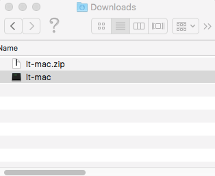
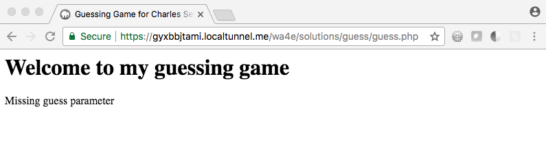
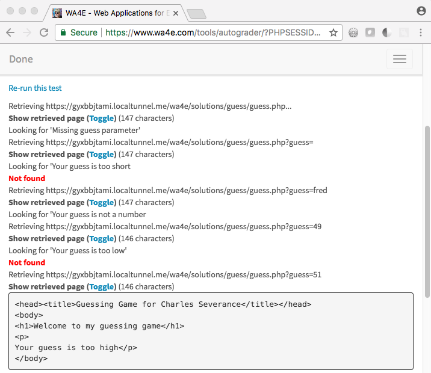

Using LocalTunnel on Macintosh
==============================

In this document we show you how to submit your running application to the
autograder.  The PHP autograder wants to "use" your application and test it
by sending requests and checking the responses from your application.

You cannot submit a URL like `http://localhost:8888/homework/guess.php`
because "localhost" only works for network conections originating *within*
your computer and your computer protects your computer from
incoming connectsion (i.e. they are blocked by a firewall).

Unless you install your application on a server with Internet
connectivity and a domain name, you need to use a program like `localtunnel` to
submit your program to the autograder.

Applications like localTunnel (or ngrok) can make a temporary hole
through your firewall and give you a temporary domain name you can
use to submit your application to the Autograder.

LocalTunnel is a free product and service and is suitable for use for
this class.  If you want a more full-featured product, you might be interested
in "ngrok" which has a "freemium" pricing model.

Installing LocalTunnel
----------------------

You have two choices as to how to install LocalTunel.  

(a) You can visit
<a href="https://localtunnel.me/" target="_blank">https://localtunnel.me/</a>
And follow their (rather complex) instructions. 

or

(b) If you take a look at their instructions and find them too complex, we
have simplified the install into a single download:

<a href="../downloads/lt-mac.zip">Download LocalTunnel for Macintosh</a>
When you download the file it will probably end up in `Downloads`
folder.  You can double-click the ZIP file to unzip it to create a file
named `lt-mac`.

To run `lt-mac` from the `Downloads` folder, in the terminal window type:

    cd ~/Downloads
    ./lt-mac -p 8888
    your url is: https://gyxbbjtami.localtunnel.me

You should note the temporary URL that LocalTunnel has assigned you 
for use later.
In this example, the temporary URL is `https://gyxbbjtami.localtunnel.me`.

Leave `lt-mac` running in this window.

You can also move the `lt-mac` file to another folder, perhaps into a folder
that is in your path so you can execute `lt-mac` from any folder.

Checking Your Application Locally
---------------------------------

First make sure that you know that your application is running on localhost:

Checking Your Application Via the Tunnel
----------------------------------------

Construct the LocalTunnel url by removing 
the "http://localhost:8888" and replace it
with the LocalTunnel-provided URL:

    Local:  http://localhost:8888/wa4e/solutions/guess/guess.php
    Tunnel: https://gyxbbjtami.localtunnel.me/wa4e/solutions/guess/guess.php

Test that url in your browser.  The LocalTunnel and local urls should
return the exact same page.

Once you have verifed your application is working, submit the LocalTunnel url
to the autograder.

Closing LocalTunnel
-------------------

You can press `CTRL-C` in the LocalTunnel terminal window or simply close the
LocalTunnel window.

Remember that each time you start `lt-mac`, it will assign you a different
random address.

