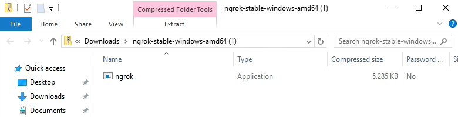
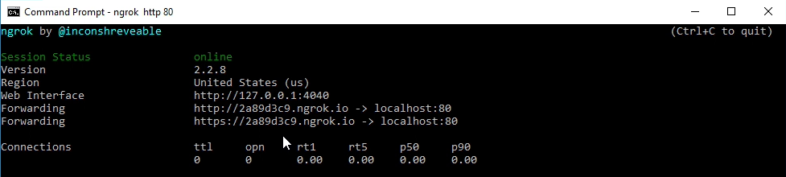
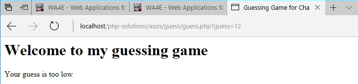
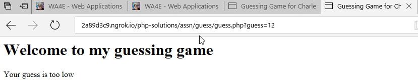
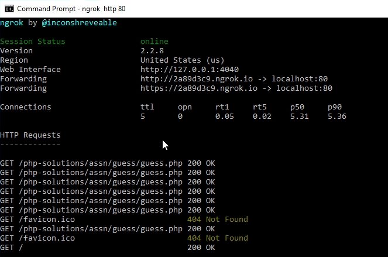

Using Ngrok on Windows
======================

In this document we show you how to submit your running application to the
autograder.  The PHP autograder wants to "use" your application and test it
by sending requests and checking the responses from your application.

You cannot submit a URL like `http://localhost/homework/guess.php`
because "localhost" only works for network conections originating *within*
your computer and your computer protects your computer from
incoming connectsion (i.e. they are blocked by a firewall).

Unless you install your application on a server with Internet
connectivity and a domain name, you need to use a program like `ngrok` to
submit your program to the autograder.

Applications like ngrok can make a temporary hole
through your firewall and give you a temporary domain name you can
use to submit your application to the Autograder.

Ngrok is a "freemium" product that provided a low-level of service for free.
The free level of the product should be sufficient for the purposes of
autograding your assignment for this course.  

Video Tutorial
--------------

You can watch a video demonstrating the use of Ngrok on Windows 10 at:

<a href="https://www.youtube.com/watch?v=9gaaVbX0USI&list=PLlRFEj9H3Oj7FHbnXWviqQt0sKEK_hdKX" target="_blank">https://www.youtube.com/watch?v=9gaaVbX0USI</a>

Installing Ngrok
----------------

First you need to download and install ngrok from
<a href="https://www.ngrok.com" target="_blank">www.ngrok.com</a>.
When you download the file it will probably end up in `Downloads`
folder.  The ZIP file will probably automatically open so you can copy the 
ngrok executable file to a folder on your system such as the Desktop.

To run `ngrok` from the `Desktop` folder, start a Command prompt and type:

    cd Desktop
    ngrok http 80

Ngrok should start up and show a user interface like this:

You should note the temporary URL that ngrok has assigned you for use later.
In this example, the temporary URL is `http://2a89d3c39.ngrok.io` - record
that for later.

You can place the `ngrok` executable command in any folder you like.  

Checking Your Application Locally
---------------------------------

First make sure that you know that your application is running on localhost:

Checking Your Application Via NGrok
-----------------------------------

Construct the ngrok url by removing the "http://localhost" and replace it
with the ngrok-provided URL:

    Local: http://localhost/php-solutions/assn/guess/guess.php
    Ngrok: http://2a89d3c39.ngrok.io/php-solutions/assn/guess/guess.php

Test that url in your browser.  The ngrok and local urls should
return the exact same page.

Once you have verifed your application is working, submit the ngrok url
to the autograder.

Interestingly, ngrok shows you as it is forwarding the various HTTP requests
back and forth.

Closing Ngrok
-------------

You can press `CTRL-C` in the ngrok terminal window or simply close the
ngrok window.

Remember that each time you start `ngrok`, it will assign you a different
random address.

